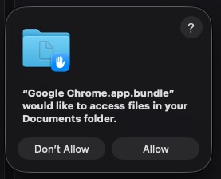

# Job Tracker - Pipeline

A simple, local-first web app for tracking multiple job applications in one place. No installation required, no cloud storage, no subscription. Just open the HTML file and start organizing your job search.

---

## What is Job Tracker?

Pipeline helps IT professionals manage multiple recruiting processes simultaneously. Instead of scattered notes and spreadsheets, or losing track of which company you're at what stage with, Job Tracker gives you a visual kanban board to track every opportunity from application to offer.

**Key benefits:**
- Your data never leaves your computer
- Works offline
- No account creation or login
- Single HTML file — no installation needed
- Free and open source

---

## Quick Start

### 1. Download the app

Download `pipeline.html` from this repository or clone it:

```bash
git clone https://github.com/yourusername/job-tracker.git
cd job-tracker
```

### 2. Open in your browser

Double-click `pipeline.html` or open it in Chrome, Edge, Firefox, or Safari.

### 3. Create your data file

On first launch, click **"Create new pipeline file"** and choose where to save your `pipeline.json` file. The app will create sample data so you can explore the interface.

That's it! You're ready to track your job applications.

---

## How to Use

### Adding a new opportunity

Click the **+ New** button in any column (Applied, Screening, Interview, Offer, Rejected) to add a job opportunity. Fill in:

- **Company name** (required)
- **Role** (required)
- **Salary range** (e.g. "$140k–$170k")
- **Work mode** (remote, hybrid, onsite)
- **Contact** (recruiter name or email)
- **Notes** (any additional context)

### Moving cards

Drag and drop cards between columns as your application progresses. Your changes save automatically.

### Tracking interview rounds

Click any card to open the detail panel. In the right pane, you'll see the interview timeline. Click **+ Add round** to log:

- Interview type (HR screen, Technical, System Design, etc.)
- Date
- Interviewer name
- Outcome (pass, fail, pending)
- Notes from the round

### Taking notes

The detail panel includes a notes section. Type your thoughts and click **Save notes** to persist them.

### Editing or deleting

Open the card detail panel and click the **Edit** or **Delete** buttons at the bottom.

### Exporting your data

Click the **⋯** menu in the header and select **Export CSV** to download your data as a spreadsheet.

---

## Features

- **Visual kanban board** — See all opportunities at a glance across 5 stages
- **Interview timeline** — Log every round with dates, interviewers, and outcomes
- **Auto-save** — Changes save instantly (Chrome/Edge) or to browser storage (Firefox/Safari)
- **Dark and light themes** — Toggle with the sun/moon icon in the header
- **Drag and drop** — Move cards between columns effortlessly
- **CSV export** — Download your data for analysis in Excel or Google Sheets
- **Privacy-first** — All data stays on your machine

---

## Browser Compatibility

| Browser | Storage Method | Auto-save |
|---|---|---|
| Chrome / Edge | File on your computer | ✅ Yes |
| Firefox / Safari | Browser localStorage | ✅ Yes |

**Note for Chrome/Edge users:** The first time you save changes, macOS or Windows may ask for permission to access the folder where your `pipeline.json` file lives. Click **Allow** — this lets the app auto-save your changes. The app only accesses the specific file you selected.

To avoid permission prompts, save your `pipeline.json` in a dedicated folder like `~/pipeline-data/` instead of Documents or Desktop.

---

## Data Privacy

Your data never leaves your computer. There are no servers, no cloud storage, no analytics. The app runs entirely in your browser and writes to a JSON file you control.

---

## Troubleshooting

### App stuck on welcome screen after creating file

This was fixed in recent versions. Make sure you're using the latest `pipeline.html` from this repository.

### Chrome asks for file access permission



This is normal behavior when using the File System Access API. Click **Allow** to enable auto-save. See the Browser Compatibility section above for details.


### I want to move my data to another computer

Copy your `pipeline.json` file to the new computer and open it with Pipeline using **"Open existing file"**.

### Firefox/Safari: How do I export my data?

Click the **⋯** menu and select **Export JSON** to download your data file.

---

## Contributing

This is a single-file web app with no build process. To contribute:

1. Fork this repository
2. Edit `pipeline.html` directly
3. Test by opening the file in your browser
4. Submit a pull request

For technical documentation, see `TECHNICAL.md` (included in the repository but not published to GitHub).

---

## License

MIT License — use this app however you like. See LICENSE file for details.

---

## Support

Found a bug or have a feature request? Open an issue on GitHub or submit a pull request.
